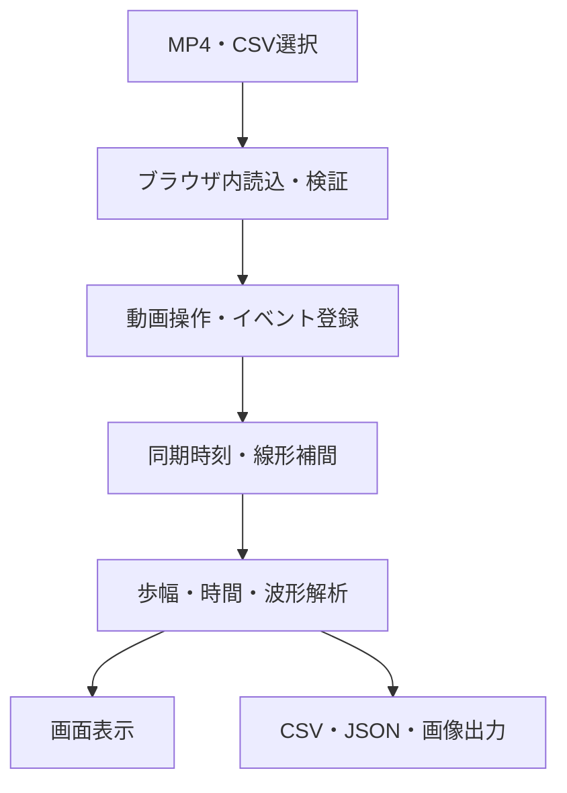

# 動画・CSV連動 歩行／ステップ動作解析Webアプリ 技術提案書

**文書版:** 0.1  
**作成日:** 2026年9月11日  
**前提:** VS Code上でClaudeによる実装、Codexによる確認・修正を行い、GitHubでソース管理・公開する

## 1. 提案概要

本アプリは、MP4動画とOpenCap等のCSVをPCブラウザ内で読み込み、動画上で手動登録した歩行・ステップイベントに対応する運動学データを解析する静的Webアプリケーションとして構築する。

動画・CSV本体をサーバーへ送信せず、計算、グラフ表示、CSV・JSON生成をブラウザ内で完結させる。サーバー側の患者データ保存を不要とし、GitHub Pages等の静的ホスティングからURLで利用できる構成とする。

## 2. 推奨技術構成

| 領域 | 推奨技術 | 用途 |
|---|---|---|
| 言語 | TypeScript | 型安全な計算・データ管理 |
| UI | React | イベント登録、一覧、設定、結果表示 |
| ビルド | Vite | 開発・静的ビルド |
| スタイル | CSS Modulesまたは通常CSS | PC向け画面設計 |
| CSV解析 | Papa Parse | 大容量CSV、文字列解析 |
| グラフ | Plotly.jsまたはApache ECharts | 波形、平均±SD、ズーム |
| 入力検証 | Zod | 設定値・保存JSONの検証 |
| ZIP | JSZip | 複数CSVの一括出力 |
| テスト | Vitest | 計算ロジックの単体テスト |
| UIテスト | Playwright | Chrome・Edge相当の操作試験 |
| コード品質 | ESLint、Prettier | 記述規約の統一 |
| ソース管理 | Git、GitHub | 変更履歴、レビュー、公開 |
| 公開 | GitHub Pages | 静的Webアプリの配信 |

初期版はバックエンド、データベース、利用者アカウントを設けない。将来、解析結果共有や共同編集が必要になった場合のみバックエンド導入を検討する。

## 3. システム構成



動画は`HTMLVideoElement`でローカルObject URLとして再生し、CSVはJavaScriptメモリ上へ読み込む。外部へ送信するAPIは実装しない。

## 4. 推奨ディレクトリ構成

```text
src/
  components/       画面部品
  features/
    file-import/    動画・CSV読込
    video-player/   再生・コマ送り・ズーム
    events/         イベント登録・編集
    synchronization/同期変換
    gait-analysis/  歩幅・歩行時間解析
    step-analysis/  ステップ解析
    waveform/       0～100%正規化・グラフ
    export/         CSV・JSON・画像出力
  domain/           型、計算式、用語定義
  workers/          CSV解析等のバックグラウンド処理
  test-data/        匿名化した基準データ
  tests/            単体・統合テスト
docs/
  requirements.md
  technical-proposal.md
  formulas.md
  validation.md
```

UIから計算式を直接呼び出さず、`domain`または各解析機能の純粋関数として実装する。これにより、Claudeが実装した計算をCodexおよび自動テストで独立して検証できる。

## 5. データモデル

### 5.1 イベント

```ts
type GaitEventType = "Rt_IC" | "Lt_IC" | "Rt_Off" | "Lt_Off";

interface GaitEvent {
  id: string;
  type: GaitEventType;
  videoTimeSec: number;
  estimatedFrame: number | null;
  csvTimeSec: number;
  csvLowerIndex: number;
  csvUpperIndex: number;
  confidence?: "clear" | "uncertain";
  note?: string;
}
```

イベントIDは時刻ではなくUUIDとし、同一時刻に異なるイベントを安全に保持する。

### 5.2 同期設定

```ts
type SyncMode =
  | "proportional"
  | "none"
  | "offset"
  | "two-point";

interface SyncSettings {
  mode: SyncMode;
  videoDurationSec: number;
  csvStartSec: number;
  csvEndSec: number;
  offsetSec?: number;
  anchor1?: { videoSec: number; csvSec: number };
  anchor2?: { videoSec: number; csvSec: number };
}
```

初期版では`proportional`のみを画面へ公開しても、型は将来拡張を考慮する。

### 5.3 解析設定

```ts
interface AnalysisSettings {
  thighLength: number;
  shankLength: number;
  pelvisWidth: number;
  lengthUnit: "cm" | "m";
  originalPositiveDirection: "left-forward";
  pelvisCorrection: boolean;
  normalizationPoints: 101;
}
```

### 5.4 保存JSON

保存対象は、アプリバージョン、元ファイルの識別情報、列割当、身体計測値、同期設定、イベント、解析設定、警告とする。動画・CSV本体はJSONへ埋め込まない。

ファイルの取り違えを検出するため、ファイル名だけでなくサイズ、最終更新日時、可能であればSHA-256ハッシュを保存する。

## 6. 動画処理

### 6.1 読込

- `<input type="file" accept="video/mp4">`で取得
- `URL.createObjectURL()`でローカル再生
- ファイル変更時に旧Object URLを破棄
- `loadedmetadata`後に再生時間・解像度を取得

### 6.2 コマ送り

固定fps動画では、1フレーム相当時間を`1 / fps`として`currentTime`を更新する。ただしブラウザのシークはデコード可能時刻へ丸められる可能性がある。

そのため、画面表示は以下のように区別する。

- 動画時刻：主たるイベント情報
- 推定フレーム番号：補助情報

fpsを取得できない場合は利用者が30／60 fps等を選択する。可変フレームレートの厳密なフレーム単位操作が必要になった場合は、WebCodecs APIまたは事前の固定fps変換を第2段階で検討する。

### 6.3 拡大・パン

動画表示コンテナ内の`transform: translate(...) scale(...)`で実装する。拡大率、移動量を状態として保持し、イベント時刻には影響させない。

## 7. CSV処理

### 7.1 読込方法

- ヘッダー行を保持する
- 数値列は必要列のみ数値化する
- 大容量CSVではPapa Parseのworker／chunkモードを利用する
- 文字コード候補を検査し、文字化け時は利用者が変更できる
- 行番号は元CSVの行との対応を保持する

### 7.2 列マッピング

完全一致、前後空白除去、大文字小文字を無視した一致、既知別名の順で自動認識する。曖昧な一致は自動確定せず、手動選択を求める。

必須候補には以下を含める。

- 時刻列
- RightThigh.Single.Euler.y
- LeftThigh.Single.Euler.y
- RightLowerLeg.Single.Euler.y
- LeftLowerLeg.Single.Euler.y
- LowerBack.Single.Euler.x
- 右・左股関節角度
- 右・左膝関節角度

身体計測値をCSVから取得する場合は、大腿長、下腿長、骨盤幅の列も割り当てる。

### 7.3 時刻の内部表現

Unix時刻等の絶対値は、CSV先頭を0秒とした相対時刻へ変換する。浮動小数誤差を抑えるため、保存・比較では秒を使用しつつ、必要に応じて整数マイクロ秒へ変換する。

## 8. 同期エンジン

比例同期は次の純粋関数として実装する。

```ts
function videoToCsvTime(
  videoTime: number,
  videoDuration: number,
  csvDuration: number
): number {
  return (videoTime / videoDuration) * csvDuration;
}
```

境界条件として、0未満を0、動画時間を超える値をCSV終了時刻へクランプする。ただし、クランプが発生した場合は内部警告を記録する。

将来のオフセット・2点同期も同一インターフェースへ実装し、解析部は同期方式を意識しない設計とする。

## 9. 線形補間

CSV時刻配列に対して二分探索を行い、イベント時刻を挟む2点を取得する。

\[
x(t)=x_1+\frac{t-t_1}{t_2-t_1}(x_2-x_1)
\]

実装上は以下を処理する。

- 時刻がCSVデータ点と一致：その点を返す
- 重複時刻：前処理で警告し、採用規則を固定する
- 片側または両側が欠損：欠損として返し、無制限に離れた点を補間しない
- CSV範囲外：欠損および警告
- 補間に使用した下側・上側インデックスと比率を保持

## 10. 計算エンジン

### 10.1 基本方針

- 単位を内部でSI単位へ統一する
- 角度を計算直前にdegreeからradianへ変換する
- 位置計算、骨盤補正、歩幅、符号変換を別関数とする
- 各関数は入力を変更しない純粋関数とする
- 計算式と座標系を`docs/formulas.md`へ明記する

### 10.2 既存Excelとの照合

既存Excelの以下の列を基準とする。

- AB：右股長さ
- AC：左股長さ
- AD：右膝長さ
- AE：左膝長さ
- AM：右下肢距離
- AN：左下肢距離
- AP：腰距離
- AQ：腰補正なし歩幅
- AR：腰補正あり歩幅

複数の代表時点について、Excel式、手計算、TypeScript実装の3者を比較する。符号は動画で確認した「左足前方が正」と一致させる。

### 10.3 精度

- 内部計算：JavaScriptの倍精度浮動小数点
- 表示：設定した小数桁へ丸める
- CSV出力：表示より十分多い桁数を保持する
- 丸めは最終出力時のみ行う

## 11. 歩行周期・歩行相解析

イベントを時間順に並べ、同側ICから次の同側ICまでを周期候補とする。周期内の必要イベントを検索し、以下の状態を付与する。

- complete：必要イベントあり
- incomplete：必要イベント不足
- warning：順序異常または間隔異常
- excluded：利用者またはルールにより除外

病的歩行を想定し、異常順序は自動削除しない。解析に採用したイベントIDを周期結果へ保存し、修正時に再計算する。

## 12. 波形処理

同側IC間のCSVデータを切り出し、0～100％の101点へ線形補間する。

各正規化点について、採用周期間の以下を算出する。

- 平均
- 標本標準偏差
- 有効周期数

欠損値が存在する場合は、有効周期数を点ごとに保持する。周期数が1の場合、標準偏差は`NA`とする。

グラフでは個別周期を薄線、平均を太線、標準偏差を半透明帯として表示する。右・左は色だけでなく線種でも区別する。

## 13. 出力設計

### 13.1 CSV

UTF-8 BOM付きCSVを既定とし、日本語版Excelでの文字化けを抑える。数値列と単位をヘッダーで明確にする。

推奨ファイル名：

```text
<trial>_events.csv
<trial>_gait_cycles.csv
<trial>_step_length_summary.csv
<trial>_joint_waveforms_101.csv
<trial>_step_trials.csv
```

### 13.2 JSON

JSON SchemaまたはZodスキーマを用意し、`schemaVersion`を必須にする。旧バージョン読込時の移行関数を設ける。

### 13.3 グラフ

PNGまたはSVG出力を検討する。論文・発表で再加工する場合はSVGが有用だが、初期版ではPNGのみでもよい。

## 14. UI提案

PC画面を以下の3領域へ分ける。

| 領域 | 内容 |
|---|---|
| 左側 | 動画、再生操作、ズーム、イベント登録ボタン |
| 右上 | ファイル情報、身体計測値、同期・列割当、警告 |
| 右下 | イベント一覧、歩幅、時間結果、波形タブ |

イベント一覧では、時刻・フレーム・種類を編集でき、行選択で動画をその時刻へ移動する。削除には確認操作を設ける。未保存の解析状態がある場合は、ページ離脱前にブラウザ標準警告を表示する。

## 15. セキュリティ・プライバシー

- 動画・CSVの外部送信APIを実装しない
- 解析処理はブラウザ内に限定する
- アクセス解析を導入する場合も、ファイル名、イベント時刻、被験者情報を送信しない
- エラー報告に元データやファイル名を自動添付しない
- 外部CDN依存を避け、JavaScriptライブラリはビルド成果物へ含める
- GitHubへ実データ、患者動画、個人情報、秘密鍵、環境変数を登録しない
- 公開前に依存パッケージの脆弱性確認を行う

## 16. 性能・安定性

- 小規模CSVは即時処理する
- 大規模CSV解析はWeb Workerを使用し、UI停止を避ける
- 必要列のみ保持し、不要な文字列データの複製を抑える
- 波形再描画はイベント変更時に必要部分だけ再計算する
- エラー境界を設け、グラフ等の一部障害でアプリ全体が停止しないようにする
- ファイル変更時にメモリとObject URLを解放する

## 17. テスト・検証計画

### 17.1 単体テスト

- 動画時刻からCSV時刻への変換
- CSV前後点の二分探索
- 線形補間
- degree／radian変換
- セグメント前後位置
- 骨盤補正
- 元の符号からIC側基準への変換
- 最大、最小、平均、標本標準偏差
- 歩行相時間
- 101点正規化
- CSV・JSONの生成と再読込

### 17.2 基準データ検証

匿名化した小規模CSVと期待値ファイルをリポジトリへ含める。既存Excelの代表行について、許容誤差を事前定義して自動比較する。

推奨する検証ケース：

- 右足前方
- 左足前方
- 左右位置差0
- 骨盤回旋0
- 骨盤回旋正・負
- CSV点と完全一致するイベント
- CSV2点間の中間時刻
- 欠損値を挟むイベント
- 同一フレームのRt_ICとLt_Off
- 不完全な歩行周期

### 17.3 UIテスト

- ファイル読込
- 再生・コマ送り
- イベント複数登録
- 修正・削除
- タイムラインマーカー
- 結果再計算
- CSV出力
- JSON保存・再読込
- ページ離脱警告
- Chrome・Edge表示

### 17.4 研究上の検証

- 同一検者が同じ動画を再解析したイベント時刻・結果の一致
- 複数検者間の一致
- Excel手計算との一致
- 同期誤差を意図的に加えた感度分析
- 動画30 fps・CSV20 Hzによる時間分解能の限界を記録

## 18. GitHub運用

### 18.1 ブランチ

- `main`：公開可能な安定版
- 機能ごとに短期ブランチを作成
- Pull Request経由で`main`へ統合

### 18.2 Pull Request確認項目

- 要件との対応
- 計算式の変更有無
- 単体テスト追加・成功
- 基準Excelとの比較結果
- 動画・CSVが外部送信されていないか
- 個人情報や実データが含まれていないか
- Chrome・Edgeでの動作
- ドキュメント更新

### 18.3 バージョン

Semantic Versioningを採用する。

- MAJOR：結果互換性を損なう計算式・保存形式変更
- MINOR：後方互換性のある機能追加
- PATCH：計算結果の意味を変えない修正

計算式または符号規約を変更した場合は、出力ファイルへ必ずアプリバージョンを記録する。

## 19. ClaudeとCodexによる開発手順

1. 要件定義書から1機能単位でClaudeへ実装を依頼する
2. Claudeは変更対象、実装内容、テスト、未解決事項を記録する
3. Codexは差分、計算式、境界条件、テストを確認する
4. 指摘修正後に基準データによるテストを実行する
5. Pull Requestへ確認結果を残す
6. `main`統合後、GitHub Pagesのプレビューで操作確認する

AIの回答をそのまま採用せず、計算式変更時は既存Excel・手計算・自動テストの3つで確認する。特に符号、degree／radian、左右列、単位、骨盤補正、イベント境界は重点確認項目とする。

## 20. 開発段階

### Phase 0：仕様固定・基準データ作成

- Excel計算式の完全な転記
- 座標系、角度ゼロ、正負、単位の確定
- 匿名化した入力CSVと期待値作成
- 受入誤差の設定

### Phase 1：基本読込・動画操作

- React／TypeScript環境
- MP4・CSV読込
- CSV検証・列割当
- 再生、コマ送り、ズーム、パン

### Phase 2：歩行イベント・歩幅

- 4イベントの複数登録、修正、削除
- 同期、線形補間
- 歩幅、左右統計
- イベント・歩幅CSV

### Phase 3：歩行周期解析

- 歩行相時間、割合、ケイデンス
- 股・膝角度の101点正規化
- 個別・平均±SD波形

### Phase 4：保存・追加解析

- JSON保存・再読込
- ステップ動作
- 測定距離による歩行速度
- 画像・ZIP出力

### Phase 5：公開・妥当性確認

- Chrome・Edge検証
- GitHub Actionsでテスト・ビルド
- GitHub Pages公開
- 利用説明、免責、バージョン表示

## 21. GitHub Pages公開

GitHub Actionsを利用し、`main`への統合時に以下を自動実行する。

1. 依存関係の取得
2. Lint
3. 単体テスト
4. 本番ビルド
5. GitHub Pagesへデプロイ

Viteの`base`設定をリポジトリ名へ合わせる。URLは原則として次の形式となる。

```text
https://<GitHubユーザー名>.github.io/<リポジトリ名>/
```

独自ドメインは必須ではない。GitHub Pages公開前に、実データがビルド成果物へ混入していないことを確認する。

## 22. リスクと対策

| リスク | 影響 | 対策 |
|---|---|---|
| 動画とCSVの開始位置が異なる | イベント対応値の誤り | 同期情報表示、将来の1点・2点同期 |
| 可変fps動画 | フレーム番号の不正確さ | 動画時刻を主値、固定fpsを推奨 |
| CSVが20 Hz | IC付近ピークの取りこぼし | 線形補間、時間分解能を明示 |
| 符号・座標系の誤解 | 左右歩幅の逆転 | 基準動画とExcelによる自動テスト |
| 単位混在 | 距離の桁違い | 入力単位明示、内部SI統一 |
| 病的歩行の非典型イベント | 自動判定不能 | 警告後の手動確定を許可 |
| 大容量ファイル | ブラウザ停止 | Worker、推奨上限、進捗表示 |
| ページ終了 | 登録内容消失 | JSON保存、未保存警告 |
| AI生成コードの見落とし | 計算結果の誤り | 独立レビュー、テスト、Excel照合 |

## 23. 実装開始前に必要な決定・資料

- 既存Excelまたは計算式一覧
- 代表的なCSVと対応動画
- 各計算列の単位
- 股・膝・セグメント角度の正負とゼロ方向
- 骨盤補正式
- 右・左ICを含む正解イベント時刻の例
- 期待する出力CSVの見本
- 数値の小数桁と受入許容誤差
- GitHubリポジトリ名と公開先

最初にPhase 0を完了させ、計算式テストを固定してからUI実装へ進むことを推奨する。これにより、画面が完成した後に歩幅の定義や符号を変更するリスクを減らせる。
